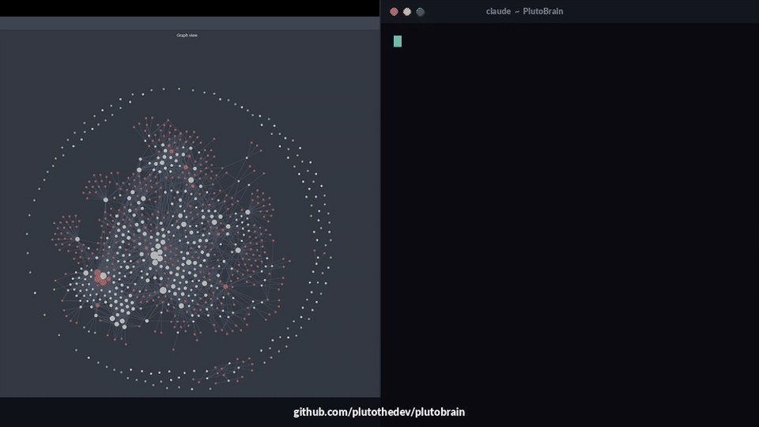

# PlutoBrain

> Your second brain, built in Obsidian, powered by Claude. A free template that turns a markdown vault into a self-wiring knowledge system you can query, refine, and grow over time.

[](https://opensource.org/licenses/MIT)
[](https://obsidian.md)
[](https://claude.com)
[](https://discord.gg/SChW8hVmRv)
[](https://youtube.com/@pluto)



## What is PlutoBrain

PlutoBrain is an Obsidian vault template that turns your notes into a system Claude can reason over. You write markdown the way you always have. PlutoBrain gives Claude the structure to read, route, refine, and answer questions across everything.

No database to install (optional). No service to run (optional). The vault IS the system of record. Open it in Obsidian, read your notes in Markdown, version-control it with git. Add a Claude session on top and you have a brain that grows with you.

PlutoBrain ships with a **skill system** — fat markdown files that encode entire workflows. Claude reads a skill and executes it. Skills compound. Your brain gets smarter every time you use it.

## New in v2.0 — Self-wiring brain

v2.0 introduces a major skill-layer upgrade. The vault now wires itself:

- **Self-wiring typed graph** — every wikilink in your vault gets typed (`works_at`, `founded`, `attended`, `drives`, `lives_in`, etc.) via a zero-LLM regex pass. Output: `typed-edges.jsonl` at vault root. Ask "who works at Acme AI?" and get a structured answer, not a guess.
- **Compiled-truth + timeline page format** — entity pages now split current understanding (rewriteable) from dated evidence (append-only). Templates for people, companies, places, concepts, vehicles ship in `00 Notes/_templates/`.
- **Cross-cutting conventions** — seven rule files (brain-first lookup, quality, capture routing, page format, tiered enrichment, model routing, test-before-bulk) that every skill references. Update once, apply everywhere.
- **Skill dispatcher (`RESOLVER.md`)** — intent → skill routing table. Stop guessing which skill fires for which phrase.
- **Five new skills** — `typed-links`, `signal-detector`, `dream-cycle`, `routing-eval`, `skillify`.
- **Durable-skill audit (`/skillify`)** — 10-item audit forces every new skill to have triggers, fixtures, tests, resolver entry, MECE check before it ships. Bugs become structurally impossible to repeat.
- **Daily dream cycle** — scheduled overnight maintenance: refreshes the typed graph, runs lint, surfaces 3-5 prioritized items for your morning review.

Full v2.0 changelog: [RELEASE_NOTES.md](RELEASE_NOTES.md).

## Quick start

1. **Clone the template** to your machine:
```
   git clone https://github.com/plutothedev/plutobrain.git
   cd plutobrain
```

2. **Open in Obsidian** — File → Open Vault → select the `plutobrain` folder.

3. **Customize CLAUDE.md** — open `CLAUDE.md` at the vault root. Edit the "Who I am" section, your goals, your preferences. This is where Claude learns who you are.

4. **Open with Claude Code or Claudian** — point Claude at the vault folder. The first thing it reads is `CLAUDE.md`. Then it knows the rules.

5. **Start using skills.** Try one:
   - `/sync` — processes `inbox/` items into proper homes
   - `/save` — captures the current Claude conversation as a wiki note
   - `/query` — runs a question across your vault, returns synthesis with citations
   - `/refine` — interactive cleanup pass over entity pages
   - `/typed-links` — extracts the typed graph (new in v2.0)

6. **Run the extractor once** to populate the typed graph:
```
   python "05 Skills/scripts/typed-links-extract.py" --vault "."
```

That's it. You have a working second brain.

## What's inside

```
PlutoBrain/
├── CLAUDE.md                 # The meta layer — who you are, how Claude should behave
├── GOALS.md                  # Your 1-year, 3-year, 5-10 year goals
├── patterns.md               # Recurring behavioral patterns Claude tracks
├── hot.md                    # Session cache — what you've been working on lately
├── index.md                  # Canonical-note index
├── log.md                    # Append-only chronological record
├── _blocklist.md             # Entities rejected from auto-creation
├── SETUP_GUIDE.md            # First-time setup walkthrough
├── CHANGELOG.md              # Version history
├── IDEAS.md                  # Future improvements
├── README.md                 # This file
│
├── 00 Notes/                 # All structured knowledge
│   ├── people/               # Entity stubs and hubs
│   ├── companies/
│   ├── places/
│   ├── concepts/
│   ├── vehicles/
│   ├── saved-chats/          # Conversations saved via /save
│   ├── sources/              # Articles, PDFs, books processed via /ingest
│   ├── research/             # /autoresearch output
│   ├── canvases/             # Visual maps via /canvas
│   ├── lint-reports/         # /lint output + dream-cycle reports
│   ├── email-threads/        # Email correspondence
│   ├── videos/               # YouTube video notes
│   └── _templates/           # Entity templates (v2.0)
│
├── 01 Journals/              # Daily reflections
│   └── daily/
│
├── 02 Chess Moves/           # Long-term planning
│
├── 03 Projects/              # Active project work
│
├── 04 Reviews/               # Weekly + monthly reviews
│
├── 05 Skills/                # The skill system
│   ├── RESOLVER.md           # Intent → skill routing table (v2.0)
│   ├── sync.md
│   ├── save.md
│   ├── ingest.md
│   ├── query.md
│   ├── refine.md
│   ├── lint.md
│   ├── autoresearch.md
│   ├── canvas.md
│   ├── new-project.md
│   ├── weekly-update.md
│   ├── pre-mortem.md
│   ├── typed-links.md        # v2.0
│   ├── signal-detector.md    # v2.0
│   ├── dream-cycle.md        # v2.0
│   ├── routing-eval.md       # v2.0
│   ├── skillify.md           # v2.0
│   ├── conventions/          # Cross-cutting rules (v2.0)
│   ├── eval/                 # JSONL routing fixtures (v2.0)
│   └── scripts/              # Python scripts (v2.0)
│
├── inbox/                    # Universal capture zone
└── media/                    # Images, PDFs, attachments
```

## Skills

PlutoBrain skills live in `05 Skills/`. Each skill is a markdown file with:

- **Frontmatter** — name, description, trigger phrases, model choice
- **When to run** — explicit triggers
- **Conventions followed** — cross-references to `05 Skills/conventions/`
- **End-to-end behavior** — step-by-step what the skill does
- **Verification** — test cases / run logs

Invoke a skill by name (`/<skill-name>`) or by trigger phrase. The dispatcher at `05 Skills/RESOLVER.md` maps phrases → skills.

### Skill inventory

**Core (v1.x):**

| Skill | What it does |
|---|---|
| `sync` | Process `inbox/` items end-to-end (entity extraction, wikilink injection, stub creation, routing) |
| `save` | Save the current Claude conversation as a structured wiki note |
| `ingest` | Process a single source (URL, PDF, file, paste) into a source note |
| `query` | Run a question against the vault, return cited synthesis |
| `autoresearch` | 3-round autonomous web research loop on a topic |
| `canvas` | Generate Obsidian Canvas (.canvas) files for visual maps |
| `lint` | Read-only vault health check |
| `refine` | Interactive cleanup + enrichment pass |
| `new-project` | Spawn a new project under `03 Projects/` |
| `weekly-update` | Weekly context refresh |
| `pre-mortem` | Decision pre-mortem before commitments |
| `deep-context-fill` | Gap-targeted CLAUDE.md depth interview |
| `brain-setup` | Initial vault setup interview (one-time) |

**v2.0 additions:**

| Skill | What it does |
|---|---|
| `typed-links` | Regex extractor — turns wikilinks into typed graph edges. Zero LLM cost. |
| `signal-detector` | Per-turn entity capture. Saves entities + decisions + open loops before they leave context. |
| `dream-cycle` | Daily scheduled maintenance pass. Lint + typed-graph refresh + prioritized morning digest. |
| `routing-eval` | Validates that `RESOLVER.md` routes intent phrases to the right skill. JSONL fixtures + runner. |
| `skillify` | 10-item audit. Turns one-off fixes into durable skills. |

## Conventions

Cross-cutting rules in `05 Skills/conventions/`. Every skill cites these by reference instead of restating them:

- **brain-first.md** — 5-step vault lookup before any external API call
- **quality.md** — citations, backlinks, notability gate, source attribution, LLM-artifact bans
- **capture-routing.md** — `inbox/` capture zone, routing pipeline, immutable-vs-synthesized layer enforcement
- **page-format.md** — compiled-truth + timeline format spec
- **tiered-enrichment.md** — Tier 1/2/3 promotion rules for stubs → enriched → hub pages
- **model-routing.md** — which Claude model for which task (Haiku for extraction, Sonnet for synthesis, Opus for high-stakes)
- **test-before-bulk.md** — test 3-5 items before any batch operation > 5

## The knowledge model — compiled truth + timeline

Every entity page (`00 Notes/{people,companies,places,concepts,vehicles}/`) uses the compiled-truth + timeline format:

```
---
type: person
name: Alice Example
slug: alice-example
created: 2026-05-15
status: enriched
tier: 2
---

# Alice Example

> One-line synthesis: what you need to remember about Alice.

## Compiled truth

Current best understanding. Prose, citations, wikilinks. Gets rewritten as evidence accumulates.

## Mentioned in

- [[page-name]] — short context phrase (2026-05-12)

---

## Timeline

- 2026-05-15: Stub created from inbox item.
- 2026-05-12: First mentioned in [[2026-05-12-saved-chat]] in context of Q2 hiring.

(Append-only. Never edit existing lines; only add new ones at the top.)
```

The `---` divider is the boundary. Above: synthesis (rewriteable). Below: evidence (append-only). `/lint` checks for the divider; `/refine` migrates old-format pages.

Templates for each entity type live in `00 Notes/_templates/`.

## Optional: brain CLI runtime

For users who want hybrid vector + keyword search, an MCP server exposing the brain to Claude clients natively, and a durable job queue for background work — the brain CLI runtime is an optional add-on. PlutoBrain works fully without it.

See the install guide at `00 Notes/setup/brain-cli-install.md` if you want the CLI layer. Otherwise the Python scripts in `05 Skills/scripts/` are the working v1 implementation.

## Philosophy

A few principles that drive PlutoBrain:

1. **Markdown is forever.** The vault works without Obsidian, without Claude, without any tool. It's plain files on disk you can read in any editor in 30 years.
2. **The system gets smarter while you sleep.** The dream cycle refreshes the graph, surfaces what's drifted, queues your next attention.
3. **Skills compound.** Every fix you skillify makes the system permanently smarter. The brain grows tools as you grow.
4. **You stay in the loop.** No edits to your meta files (`CLAUDE.md`, `GOALS.md`, `patterns.md`) without approval. Claude proposes; you decide.
5. **Brain-first, web second.** Before any external API call, the vault gets checked. Stop re-explaining yourself to AI.

## Contributing

Issues and PRs welcome. The repo is a template — fork it, customize it, make it yours. If you build a new skill that's broadly useful, open a PR with the skill file + fixture file + script (if any) + a routing-eval entry. The skillify audit (`/skillify`) ensures every new skill ships with frontmatter, tests, fixtures, and a resolver entry.

## Community

Pluto Discord: https://discord.gg/SChW8hVmRv

Follow on YouTube: https://youtube.com/@pluto

## License

MIT. See [LICENSE](LICENSE).
